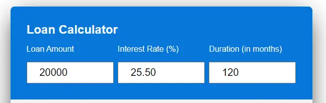

# FnT Loan Calucaltor

## Introduction

This is a web-based loan calculator app designed for a loan brokering company, FnT. The app will enable prospective customers to evaluate loan options in terms of loan amount, period, and interest rate. The app will return with a monthly premium, total repayable amounts, total interest payable, and their graphical representation.


## Project Idea

FnT is in the business of loan broking where they earn commission from banks and financial institutes by matchmaking individual financial requirements with the institutes. 

Now they need a web-based responsive application as a part of their website. This would be used to initiate interaction and enhance the brand recall of FnT financial brokers. 

## Design for User Experience (UXD)

This section covers a summary of the 5 planes of user experience design. We briefly discuss,

1.	Strategy Plane
2.	Scope Plane
3.	Structure Plane
4.	Skeleton Plane
5.	Surface Plane  

# Strategy Plane

For the app, in this section, we discuss Generic Strategy, target audience, and objectives (both internal and external), as a part of the strategy plane of UXD, 

## Generic Strategy & Differentiation – Niche Marketing 
The firm is differentiating from other brokers with a consultative, interactive, and transparent selling strategy. 

## Target Audience

In par with the business strategy, the target audience shall be,

- Income – Upper and upper-middle class
- Gender – Male Female
- Education: Would like to learn more, Well-educated  
- Age: 16-55
- stage in the life: Life stly ranges from competed secondary school, young & senior execuitves, couples with and without kids
- Lifestyle: want to grow in thier lives and do not want to be limited by finaicial challenges
- Profile examples: Professional individuals and couples, couples to get married soon

## App Objectives

We have looked into the purposes of both the client and the owner of the site for ensuring maximum mileage for both parties. 

For FnT (site owner), the app is expected to,

1. Provide interaction opportunities with the site
2. Increase brand recall
3. the First call to action to interact with the firm for obtaining service 
4. Reach and get in touch with potential clients. 
5. Profile building, positioning, and differentiating from the rest of the competition  

## Purpose of the Site – Visitor
1. Tool to evaluate various loan terms
2. to know the monthly premiums to be paid and evaluate the affordability for the terms
3. at a visual idea of the amount of interest to be paid as opposed to the amount to be borrowed

# Scope plane

The site will consist of features as follow, in line with the objectives of visitors and the owners.

## Features
For the whole site, 

## Favicon
- Using tree letter of the logo, favicon is displayed in the browser tab
- This will help a user to easily identify the site among many tab opened in a browse 

    
    

## Page Title

- A title tag that gives a brief description of the respective page is created for every page to appear on top of the page.
- This will help not the only user to easily understand the content of the page but also appear on the search engine result page (SERP) and help search engine optimization (SEO).

    

### Logo
- A logo is used in the app 
- This will help for both ease of recognition and building the brand image of FnT loan brokers

    

## The app
The app consists of three main features
    - Data input section
        - This allows the user to insert numerical values into the app.
        - it includes (loan amount, interest rate, and duration).
        - These are the main variables for calculating various results.
        - Variables are verified as the user enter input and alert them for corective actions.

   
    
    - Numerical result section
        - This section gives the result in number form 
        - The results include,
            - Monthly premium
            - Total interest payable 
            - Total amount payable
    


    - Graphical results section
        - this will show the user’s total interest and loan amount in a pie chart
        - This allows the user to take a quick evaluation by comparing the two outcomes and changing the input variables


## Existing Functional Features,
- Responsive design
- Numarical results
- Graphical reuslts in a form of a pie chart

## Existing Non-functional Features
- Simple well-defined layout
- Simple but consistent web designed for maximizing user experience
- Content and images developed for SEO optimization
- Optimize images for faster functioning of the site
- The site is designed for scalability

## Features to be Implemented
- Contact form under the app
- Thank you, page, to confirm the receipt of the contact form and commit to revert back in 24hr


# Structure Plane

The app is deployed as a part of overall site structure.
The contractual agrement is limited to develpment of the app at this stage.
It will be followed by contact form as a part of the app and thank you page.
However, the overall site development is not within the scope of the project.

# Skeleton Plane
The following components shall be used to give a pleasurable and still objective experience for visitors of the site, 
- Use visual icons
- Apply Progressive disclosure
- Keep a consistant shape of the app 
- Use more white space for pleasing app interaction
- Use of representational familiar icons with clear meaning be a better visual representation and useability  

## Information design
- Pleasing design
- Accurate categorization of components (e.g.: input section, numarical rsults section, and graphical results section)
-  Use a minimalist approach to designing
- Wireframe

## Wireframe

- App on mediums and big screens (bigger than 650px)

    

- App on small screens

    ![App on smaller screens]](assets/images/wirefreammobile.webp)

# Surface Plane
In order to bring a visually appealing experience, we shall use, 
- Colors: Logo and site colors were picked from  - trends. 
- The selected colors were only used throughout the app. 
 
     

- Fonts 

[Google](https://fonts.google.com/) fonts were used for all Headings and paragraph throughout the site. 

- Layout 

Maintained a consistent layout across the app. 
It was prioritized to create more whitespace in so that the user will find it easy to follow.

- Images

All the images were optimized by,

- converting to webp using, [cloud convert](https://cloudconvert.com/webp-converter0 and 
- then, further optimized using, [tinypng](https://tinypng.com/)

- Order/ Sequence

Identity, to ensure economy, readability (legible, contrast, consistency)

The above concludes the UXD section of the website.

# Techno Used

## HTML
The app is structured using Hypertext Markup Language (HTML) version 5 as the main language.

## CSS
To style the app, the Cascade Style sheet (CSS) version 3 is used as an external file.

## javaScript
JavaScript was use to develop the logical aspects of the app.

## Git Pod 
The app was developed in GitPod

## Git Hub
Hosting of the source codes are on Git hub and Git pages are used to deploy the app


## Favicon.io
Favicon is used for browser tabs created using [Favicon](https://favicon.io/favicon-converter/)

## Balsamiq
wireframes were created using [Balsamiq](https://balsamiq.com/wireframes/desktop/#)

## Cava.com
The app logo was created using [canva](http://canva.com)	

## font 
[Google font]( https://fonts.google.com/) was used to have a set of standardised fonts acrros the site.

## Keywords 
For identifing key words, [SERanking](https://seranking.com/) was used.

## Check for Code Differances
TO check code variations [Diffchecker]https://www.diffchecker.com/) was used.

## Formating and Indetation of HTML
[Scott Granneman](https://granneman.com/webdev/coding/formatting-and-indenting-your-html) is used as a gudince when formating and indenting HTML

# Testing 
Testing covers will look into Responsiveness, Accessibility, Lighthouse testing, Functional testing, validator testing, and unfixed bugs

## Responsiveness

According to the [WCAG 2.1 Reflow criteria](https://www.w3.org/WAI/WCAG21/Understanding/reflow.html) for responsive design  on Chrome, Edge, Firefox, and Opera browsers, all pages were evaluated to ensure responsiveness on screen sizes starting at 320 pixels and up.

Process of Testing:

1. Launch a browser and go to the app.
2. Go to the developer tools, and (right-click and inspect)
3. Set to responsive, with a 320px reduction in width.
4. 50% Zoom setting
5. Drag the responsive window to its widest point.

#### Expected:

No graphics are distorted or stretched, and the app is responsive across all screen sizes. There is no horizontal scroll. Nothing overlaps. 

####Actual:

The app performed as expected. Information is available in Unfixed Bugs.

Moreover, the app was launched on the following

- Apple iphone 11
- Samsug galaxy S22

## Accessibility
[Wave](https://wave.webaim.org/) is used to check for any aid accessibility testing, an accessibility tool was utilized during development and for final testing of the launched website.

The following requirements were tested to make sure they were met:

- All forms contain associated labels or aria-labels so that users who tab to form inputs can hear this information read out on a screen reader.
- The WCAG 2.1 Contrast Guidelines' minimum ratio for colour contrasts is met. Except for one contrast issue in the footer.
- Assure to highlight the significance of the content to a visitor, no heading level is missed or skipped.
- For easy use of assistive technology, every content is with the landmark so that users could easily navigate by page region
- Atl-tags were given to all the non-textual content
- HTML page lang attribute is set
- Aria properties are set correctly
- Accordinglyly, best practices of WCAG 2.1 coding test are followed to a greater extent.

## Lighthouse Testing

### Home Page on a Desktop

   

### Case Studies Page on a Desktop

   

### Contact Page on a Desktop

   

## Functional Testing

### Navigational Testing
By clicking navigation on each of the pages, examined the navigation performance of all the navigation links.


| Navigation Link   | Page to be loaded |
| -----------  | ----------- |
| Hone        | index.html       |
| Case Studies     |case-studies.html |
| Contact       |contact.html |

**Required** : Links to all the pages navigated as expected 

**Actual**: the requirement is met 

### Contact Details Testing

The phone and email of the contact page were tested for their desired functionality 

### Call Testing

Steps, 

1.	Navigate to the contact page, https://pjdevex.github.io/supun-maximus/contact.html
2.	Click on the mobile number given

**Required**: a popup will appear asking to pick up an app to call

**Actual**: the expectation was met 


### Email Testing

Steps, 
1.	Navigate to the contact page, https://pjdevex.github.io/supun-maximus/contact.html
2.	Click on the email given

**Required**: a popup will appear asking to pick up an application to send a message or directed to the default application.

**Actual**: the expectation was met 


### Form Testing

The form on the contact page was manually tested. It performed as expected where required data is skipped or inserted without following the guidance given, will not be allowed to proceed.

**Scenario 1 – Correct Input**
1.	Navigate to Supun Maximus – Contact page https://pjdevex.github.io/supun-maximus/contact.html
2.	Scroll down to the form and insert the below data, 

-       First Name: Peter
        Last Name: Jack
        Mobile: 770 088 586
        Email: peter.jack@test 
        Age Category: 20-34
        Gender: Male
        Message: this is a test
3.	Click submit
4.	User shall be landed in https://formdump.codeinstitute.net/ 

**Required**: Proceed with submission with no warnings and errors to the congratulation page!

**Actual**: requirement was met

**Scenario 2 – Missing Required Field, First Name**

1.	Navigate to Supun Maximus – Contact page https://pjdevex.github.io/supun-maximus/contact.html
2.	Scroll down to the form and inset below deta
-       First Name: 
        Last Name: Jack
        Mobile: 770 088 586
        Email: peter.jack@test 
        Age Category: 20-34
        Gender: Male
        Message: this is a test
3.	Click submit


**Required**: Cannot proceed without the first name for submission, a warning appears

**Actual**: requirement was met

**Scenario 3 – Missing Required Field – Last Name**

1.	Navigate to Supun Maximus – Contact page https://pjdevex.github.io/supun-maximus/contact.html
2.	Scroll down to the form and insert below data
-       First Name: Peter
        Last Name: 
        Mobile: 770 088 586
        Email: peter.jack@test 
        Age Category: 20-34
        Gender: Male
        Message: this is a test
3.	Click submit


**Required**: Cannot proceed without the last name for submission, a warning appears.

**Actual**: requirement was met

**Scenario 4 – Mobile Number in Wrong Format**

1.	Navigate to Supun Maximus – Contact page https://pjdevex.github.io/supun-maximus/contact.html
2.	Scroll down to the form and insert thr below data
-           First Name: Peter
            Last Name: Jack
            Mobile: 0094 770 088 586
            Email: peter.jack@test 
            Age Category: 20-34
            Gender: Male
            Message: this is a test
3.	Click submit


**Required**: Cannot proceed without the correct format of the mobile for submission, a warning appears.

**Actual**: requirement was met


**Scenario 5 – Email in Wrong Format**
1.	Navigate to Supun Maximus – Contact page https://pjdevex.github.io/supun-maximus/contact.html
2.	Scroll down to the form and insert below data
-           First Name: Peter
            Last Name: Jack
            Mobile: 770 088 586
            Email: peter.jack.test 
            Age Category: 20-34
            Gender: Male
            Message: this is a test

3.	Click submit


**Required**: Cannot proceed without the correct format of the email for submission, a warning appears.

**Actual**: requirement was met.

### Google Map
Google map in the training time section was manually clicked

**Required**: Landed in google map with the training center in the middle of the map.

**Actual**: the requirement was met.

### Footer Social Media Links

Social media icons in the footer section, clicked manually to ensure the correct connection to external links. 

**Required**: to proceed to respective social media pages of the client (Supun Maximus) or general page as he does not have twitter or YouTube channel.

**Actual**: the requirement was met.

## Validator Testing

### HTML

No errors were returned when passing through the official [W3C validator](https://validator.w3.org/)

**Index Page HTML Validation**


**Case Studies page HTML Validation**


**Contac Page HTML Validation**


### CSS

No errors were returned when passing through the official [W3C validator](https://validator.w3.org/)


## Deployment

### Version Control
The site as created using git pod and published in git hub to the remote directory “supun-maximus”.

The below git commands were used during the development to push code to the remote repo:

```git add "<file>"``` - To add the file(s) to the staging area before they are committed. <br>

```git commit -m “commit message”``` - To the local repository queue ready for the final step. <br>

``` git push``` - To push all committed code to the remote repository on github. <br>

### Deployment to Github Pages

GitHub pages was used deplyment. 
<br>

The steps to deploy are as follows:
1.	In the GitHub repository, click on the Settings tab
2.	From the menu on left select 'Pages'
3.	From the source section drop-down menu, select the Branch: main
4.	Click 'Save' <br>

A live link is revealed in a green banner once published successfully.
The live link can be found here - https://pjdevex.github.io/supun-maximus/

## Credit

Credit shall go to below for guiding and lending technology to develop the site

### [Flexbox CSS In 20 Minutes](https://www.youtube.com/watch?v=JJSoEo8JSnc)

The video simply and effectivly guides you to use flexbox in styling the content. Most of the areas in the site, where the flex elements were used was based on the above video

### [Create interesting blob shapes with CSS](https://9elements.github.io/fancy-border-radius/)

To convert the logo into a circle, guidence of the above site was used. 

### [How To Add Google Map On Website Using HTML And CSS](https://www.youtube.com/watch?v=4U_AAGHzTok&t=227s)

Guideline of the above vedio was used to insert a google map to the site.

### [Horizontal scroll bar css fix](https://www.youtube.com/watch?v=_Js193O1PAg)
Guide lines of the above video was used to get rid of the horizontal scroll bar of the site.

### [Responsive Contact Us Form in HTML And CSS](https://www.youtube.com/watch?v=eUMqJMkwOBY&t=405s)

To create the contact page design inspirations and codes were barrowed from the mentioned video.

### [W3school](https://www.w3schools.com/default.asp)
It has been a main source of codes for developing the site.

## Content 

All the non-textual media except the background of the contact page, all were obtained from client's social media with his due permission. Fresh textual content was created for the site by factroing key words to them.

## Special Thanks
Special thanks shall go to the client, Mr Dayarathna for his good support, Daisy, my mentor ,and last but not the least to my family for their exceptional care and understanding.